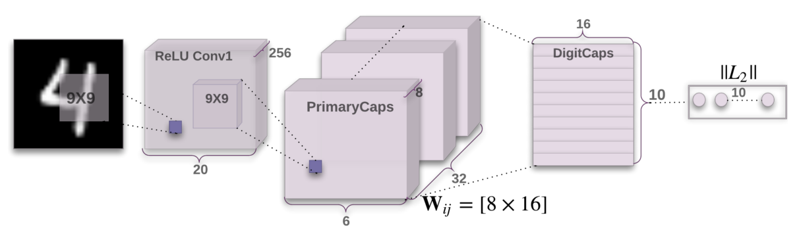

# Capsnet
Written By: 

Jaspreet Singh

Department of Computer Science

Punjabi Univesity Patiala (INDIA),
May-2020

This code is initially written by: Aurélien Géron and later modified for the application of image classification on MNIST dataset.

Capsule Networks for Image Classification (MNIST Dataset)
Based on the paper: [Dynamic Routing Between Capsules](https://arxiv.org/abs/1710.09829), by Sara Sabour, Nicholas Frosst and Geoffrey E. Hinton (NIPS 2017).

